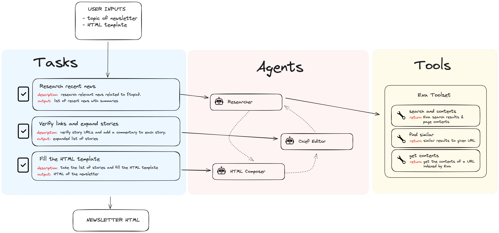

# Newsletter-Agent



An AI-powered tool for automatically generating personalized newsletters on any topic using CrewAI agents.

## Overview

Newsletter-Agent is a Python application that leverages AI agents to research, curate content, and generate professional newsletters on any topic. The system takes your inputs (topic and personal message) and produces an HTML newsletter that can be easily shared with your audience.

## Features

- 🤖 AI-powered content generation and curation
- 📝 Personalized newsletters on any topic
- 🎨 HTML template customization
- 🚀 Simple command-line interface
- 📊 Content organization with multiple sections

## Installation

### Prerequisites

- Python 3.12+
- [Poetry](https://python-poetry.org/docs/#installation) for dependency management

### Setup

1. Clone the repository:
   ```bash
   git clone https://github.com/yourusername/Newsletter-Agent.git
   cd Newsletter-Agent
   ```

2. Install dependencies using Poetry:
   ```bash
   poetry install
   ```

3. Configure your environment variables (if needed).

## Usage

Run the application using:

```bash
poetry run python -m src.newsletter_gen.main

